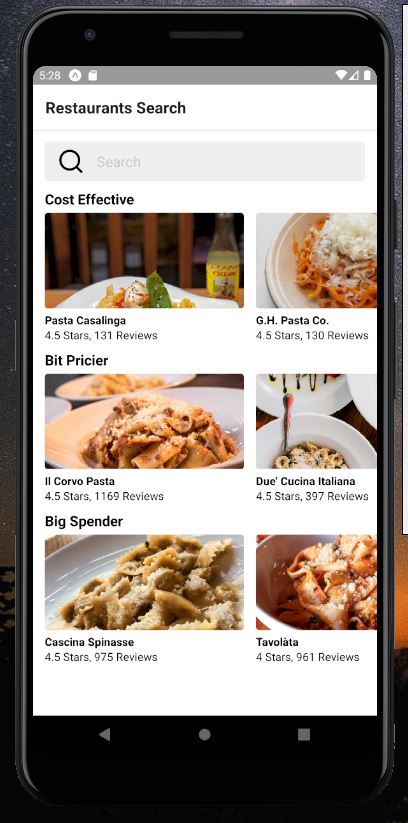
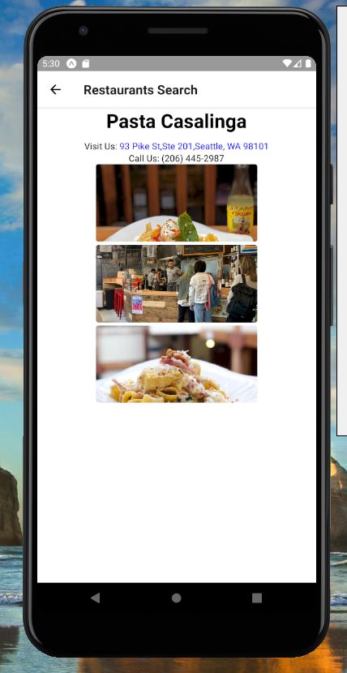

# YelpRestaurantsSearch

## Overview:

Restaurant Search App is a React Native App allow users to search for their favorite food and get 50 restaurants to choose from. We display results according to prices range to give user chance to pick what more fit her/his budget.

## Technologies Used:

- React-Native

- NPM Packages Used:
  -React
  -React-Native
  -Expo
  -Expo-CLI

## Contributors:

- <strong>Ray Wasif</strong>
  

## [Click Here to Try Our App](https://expo.io/@rayramez/restaurant-search)

## Running the App:

To try our app, click on https://expo.io/@rayramez/restaurant-search. With an Android/IOS phone, you can scan this QR code with your Expo mobile app to load this project immediately(You can download Expo from Google store if you are using Android device or App store if your are using IOS device). Or, click on Open project in the browser, to try without downloading any apps.

## Screenshots:

- Home Page
  
- Result Details Page
  
